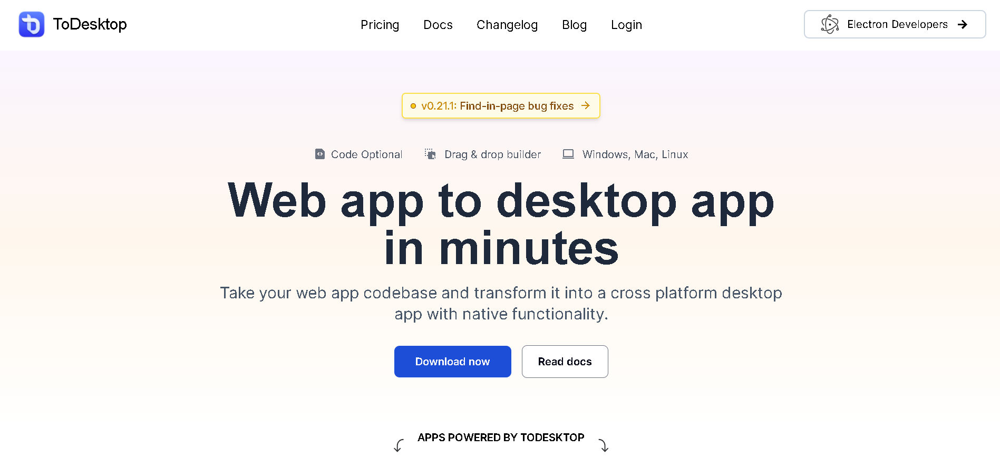

# ToDesktop UI Clone

A frontend-only clone of the [ToDesktop](https://www.todesktop.com/) website, built using **React.js** and **Tailwind CSS**. This project was created to practice and showcase my skills in building modern UIs with utility-first CSS and component-based architecture.



## 🚀 Features

- 💻 Responsive and modern UI
- 🎨 Styled with Tailwind CSS
- ⚛️ Built with React components
- 🔧 Clean project structure

## 📂 Tech Stack

- **React.js** – JavaScript library for building UIs
- **Tailwind CSS** – Utility-first CSS framework
- **Vite** / **Create React App**

## 🧠 What I Learned

- Setting up a React project from scratch
- Applying utility classes from Tailwind for layout and design
- Structuring reusable React components
- Making a fully responsive layout with Tailwind

## 📸 Screenshots


## 🛠️ Installation

1. Clone the repo:
   ```bash
   git clone https://github.com/TheVishnuDesai/ToDesktop--Tailwind---React-.git
   cd todesktop-ui-clone
